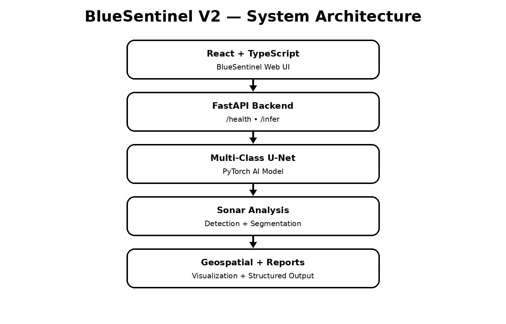

## AI-Powered Automated Underwater Marine Debris and Anomaly Detection using Side-Scan Sonar Imagery

BlueSentinel V2 is an SIH 2026 research prototype that analyses underwater side-scan sonar imagery using a custom PyTorch multi-class U-Net, FastAPI backend, and React + TypeScript dashboard.

## 🚀 Project Flow



**Side-Scan Sonar → Preprocessing → AI Detection → Confidence Scoring → Geospatial Analysis → Reports → Dashboard**

## 🎯 Detection Classes

- Submarine Pipeline
- Shipwreck
- Ghost Net
- Mine / Cylinder

## ✨ Features

- Sonar image upload
- Sonar preprocessing
- Image augmentation
- Multi-class AI analysis
- Confidence scoring
- Detection visualization
- Geospatial analysis
- GIS anomaly visualization
- Structured reports
- REST API inference
- SIH-ready dashboard

## 🧠 AI Architecture

**Input Sonar Image**  
↓  
**Image Preprocessing**  
↓  
**Custom Multi-Class U-Net**  
↓  
**Pixel-Level Anomaly Segmentation**  
↓  
**Confidence Scoring**  
↓  
**Detection Results**

## 🏗️ System Architecture

| Layer | Technology |
|---|---|
| Frontend | React + TypeScript + Vite |
| Backend | FastAPI + Uvicorn |
| AI | PyTorch + Custom U-Net |
| Image Processing | OpenCV + NumPy + Pillow |
| Deployment | Vercel + Render |
| Model Hosting | Hugging Face |

## 📂 Repository Structure

```text
BlueSentinel-V2/
├── ai/
│   ├── dataset/
│   ├── evaluation/
│   ├── inference/
│   ├── models/
│   └── training/
├── api/
├── docs/
│   ├── architecture/
│   ├── methodology/
│   └── screenshots/
├── public/
├── scripts/
├── src/
├── assets/
├── render.yaml
├── requirements.txt
├── start_backend.sh
├── vite.config.ts
└── README.md
